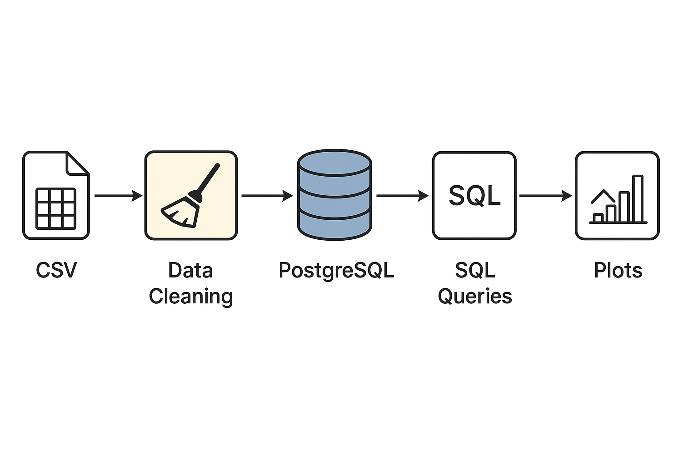

# BMW Car Sales ETL & Analysis

## Overview
An end‑to‑end ETL + analytics mini project using a synthetic BMW car sales classification dataset form Kaggle.
The pipeline:
- Extract: Read raw CSV (data/raw/BMW_Car_Sales_Classification.csv)
- Transform: Basic cleaning (drop NA, cast Year to int)
- Load: Persist cleaned dataset into PostgreSQL (table bmw_car_sales) via SQLAlchemy / psycopg2
- Analyze: Run summary queries & generate plots (saved in data/processed/)

Outputs include:
- Cleaned CSV: data/processed/cleaned_BMW_Car_Sales_Classification.csv
- Plots: sales_per_year.png, avg_price_by_model.png, success_rate_by_region.png

## Repository Structure
```
project1_csv_sql/
  data/
    raw/                
    processed/          # Cleaned CSV + generated figures
  scripts/
    etl_pipeline.py     
  notebooks/
    etl_pipeline.ipynb  
  docker-compose.yml    # Postgres + optional pgAdmin stack
  requirements.txt      # Python dependencies
```

## Requirements
- macOS (tested) & Docker Desktop
- Python 3.13 (virtual env recommended)
- Docker Compose V2 (docker compose ...)

## Quick Start
```bash
# 1. Clone (if not already)
# git clone <repo>
cd project1_csv_sql

# 2. Python virtual environment
python3.13 -m venv venv
source venv/bin/activate
pip install --upgrade pip
pip install -r requirements.txt

# 3. Start database stack (Postgres + pgAdmin)
docker compose up -d postgres pgadmin
# or just Postgres: docker compose up -d postgres

# 4. Confirm DB ready
docker compose logs -f postgres | grep 'database system is ready'

# 5. Run ETL
python scripts/etl_pipeline.py

```

## Accessing the Database
psql:
```bash
psql -h localhost -U admin -d bmw_sales -c "\dt"
```
pgAdmin:
- Open http://localhost:8080
- Login: admin@admin.com / admin
- Register new server:
  - Name: local
  - Host: postgres (inside compose network) or localhost
  - Port: 5432
  - User: admin / Password: admin / DB: bmw_sales

## Environment Variables (Optional Overrides)
| Variable    | Default    | Purpose                  |
|-------------|------------|--------------------------|
| PGUSER      | admin      | DB user                  |
| PGPASSWORD  | admin      | DB password              |
| PGHOST      | localhost  | Host                     |
| PGPORT      | 5432       | Port                     |
| PGDATABASE  | bmw_sales  | Database name            |

Export to override before running script:
```bash
export PGUSER=admin PGHOST=localhost PGPASSWORD=admin PGDATABASE=bmw_sales
```

## Script Behavior (scripts/etl_pipeline.py)
1. Reads CSV
2. Cleans (dropna, casts Year)
3. Writes cleaned CSV
4. Loads to Postgres (replace mode)
5. Executes analytical queries:
   - Yearly sales counts
   - Average price per model
   - Success rate by region (> fixed volume threshold)
   - Success rate by region (classification proportion High)
   - Success rate by region (dynamic 75th percentile Sales_Volume)
6. Saves bar charts to data/processed



## Generated Figures
| File | Description |
|------|-------------|
| sales_per_year.png | Total sales count per Year |
| avg_price_by_model.png | Average Price_USD per model (top 10) |
| success_rate_by_region.png | Fixed threshold success rate |
| success_rate_by_region_class.png | High classification proportion |
| success_rate_by_region_dynamic.png | Dynamic (75th percentile) threshold |


